============
plot_profile
============

*plot_profile* is a Python-based command line tool to retrieve and visualise both observational data as well as variables simulated with ICON

.. contents:: **Content**

------------
Installation
------------
1. ``git clone https://github.com/MeteoSwiss-APN/plot_profile.git``
2. ``conda activate base``
3. ``conda install pip``
4. ``conda deactivate``
5. ``module load python``
6. ``cd plot_profile``
7. ``make venv install-dev`` (or just: ``install``)

-----
Usage
-----
This package only works on tsa, where access to the DWH is possible.
The package expects hourly output files in netcdf-format in a folder with the name corresponding to the init-time of the simulation, YYMMDDHH.
The filenames need to follow the MeteoSwiss-style convention: lfffDDHHMMSS.nc
(e.g. lfff00010000.nc corresponds to a model leadtime of +1h).

First activate the conda environment: ``conda activate plot_profile``.

The available entrypoints of the package can be displayed with: ``plot_profile -h``.
The available stations can be listed with: ``plot_profile --stations``.
The available variables can be listed with: ``plot_profile --variables``.

Further down you find example commands and corresponding graphs for each entrypoint.

Most important options
======================

- ``date``: Init or valid date. -> YYMMDDHH, except for radiosounding plots which include the full year.
- ``add_obs``: Observation, 2 arguments -> device, variable.
- ``add_model``: Simulated variable, 3 arguments -> model, variable, identifier.
- ``model_src``: Information about model -> identifier, folder, YYMMDDHH of simulation init.
- ``height_src``: File containing HEIGHT/HHL -> identifier, full path.
- ``height_file``: File containing HEIGHT/HHL -> full path.
- ``colours``: Matplotlib colour name -> one colour for each line, ordering does not necessarily follow user input.
- ``xmin``, ``xmax``, ``ymin``, ``ymax``: Min and max values for x- and y-axis.

plot_rs
=======
Plot radiosoundings

``plot_rs --date 2021111912 --params temp --params dewp_temp --alt_top 2500`` 

.. image:: example_graphs/rs_211119_12_temp_dewp_temp_pay.png
  :width: 400
  
``plot_rs --date 2022011112 --params temp --clouds --relhum_thresh 95 --grid``

.. image:: example_graphs/rs_220111_12_temp_pay.png
  :width: 400
  
``plot_rs --date 2022041912 --params temp --params dewp_temp --params wind_vel --params wind_dir``

.. image:: example_graphs/rs_220419_12_temp_dewp_temp_wind_vel_wind_dir_pay.png
  :width: 400
  
``plot_rs --date 2017101602 --params temp --params dewp_temp --loc inn``

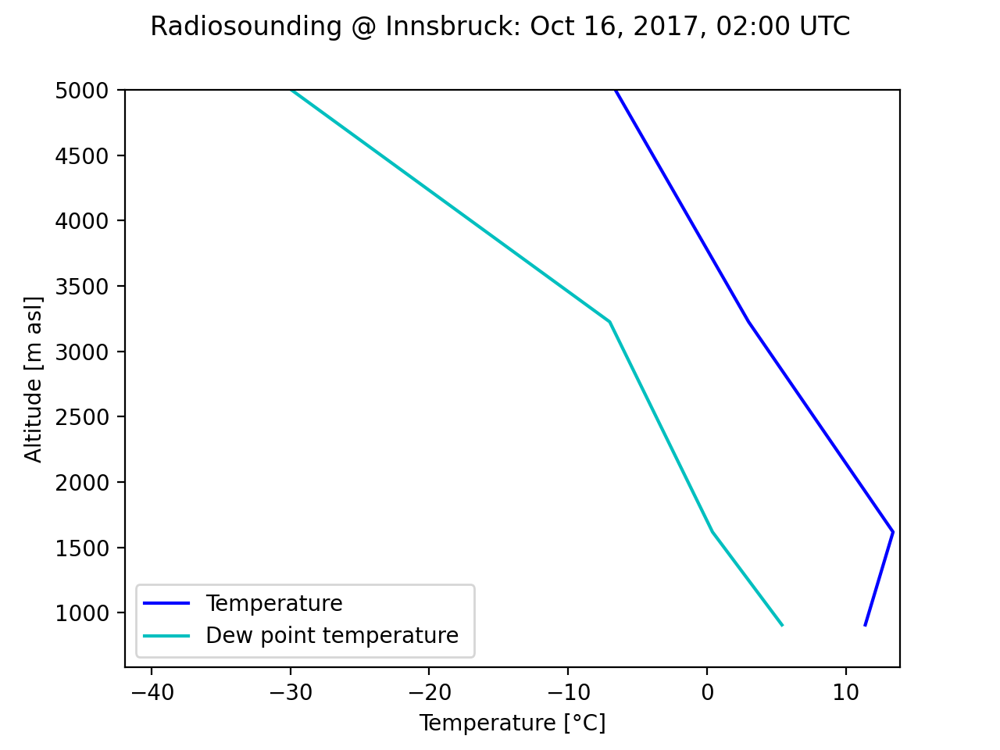
  
plot_profiles
=============
Compare vertical profiles of e.g. temperature measured by radiosounding and simulated by model *for 1 specific leadtime*.
``exp`` and ``ref`` serve as identifiers to connect an ``add_model``-statement to the ``model_src``.

- ``add_model``: *model variable identifier*

- ``model_src``: *identifier path date*

``plot_profiles --loc ifl --date 19091312 --add_model icon temp ref --add_model icon qv ref --model_src ref /store/s83/swester/teamx/tdf_2019091212/output/ 19091212 --height_src ref /store/s83/swester/teamx/tdf_2019091212/output/19091212/lfff00000000c.nc``

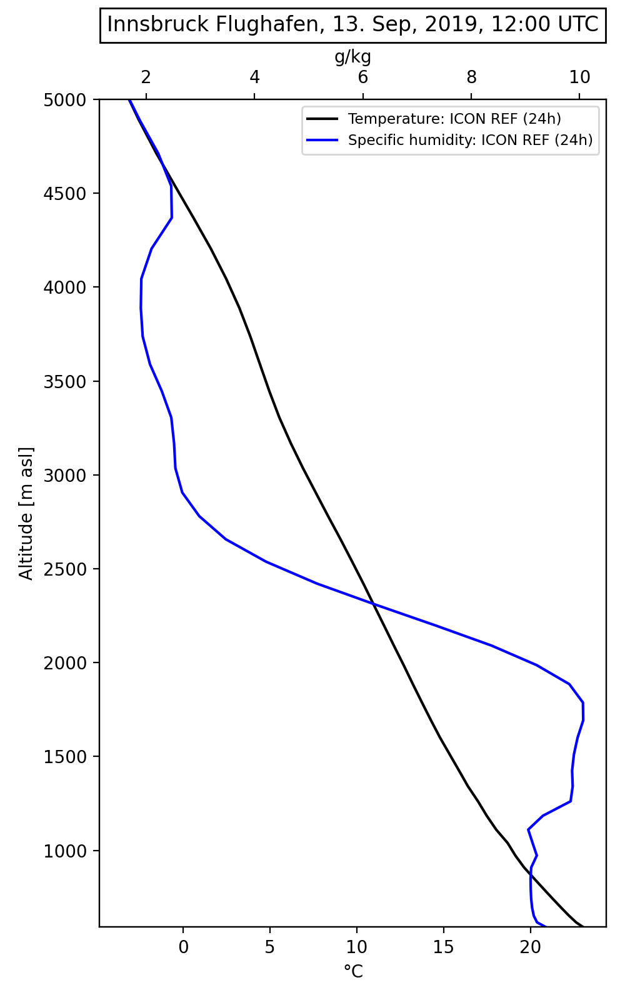

``plot_profiles --loc pay --date 21111900 --add_obs rs temp --add_model icon temp ref --add_model icon temp exp --model_src ref /scratch/swester/output_icon/ICON-1/ 21111812 --model_src exp /scratch/swester/output_icon/exp1/ 21111812``

.. image:: example_graphs/profiles_211119_00_pay_icon~ref_temp_icon~exp_temp_rs_temp.png
  :width: 300
  
plot_timeseries
===============
Timeseries of 1 or multiple observed and/or modelled variables. The selected variables overall may not have more than 2 differing units.

! ``start`` of variables which are accumulated in ICON (radiation, precip) always has to match the init-date of the simulation

``plot_timeseries --loc ulr --start 19091212 --end 19091318 --add_obs 2m sw_down --add_model icon sw_down 1 exp --model_src exp  /store/s83/swester/teamx/tdf_2019091212/output/ 19091212 --height_file /store/s83/swester/teamx/tdf_2019091212/output/19091212/lfff00000000c.nc``

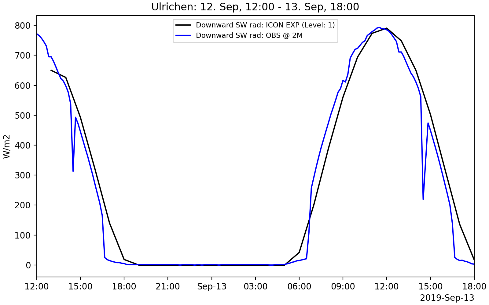
  
``plot_timeseries --loc pay --start 21111900 --end 21111912 --add_obs 2m ver_vis --add_obs 2m cbh``

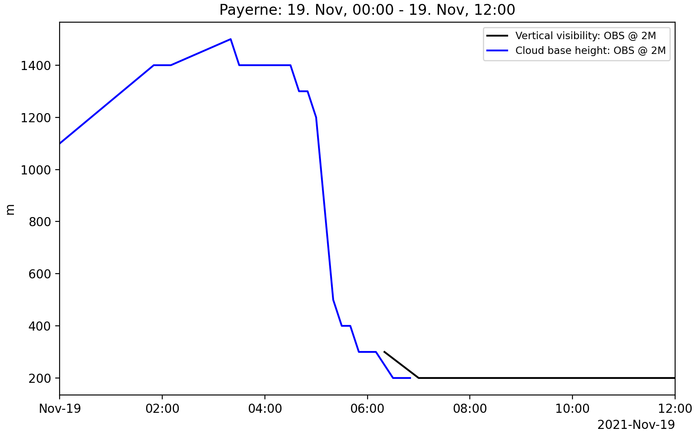
  
``plot_timeseries --loc pay --start 21111900 --end 21111906 --add_model icon temp 1 ref --add_model icon temp 1 exp --add_obs 10m_tower temp --model_src ref /scratch/swester/output_icon/ICON-1/ 21111812 --model_src exp /scratch/swester/output_icon/exp1/ 21111812``

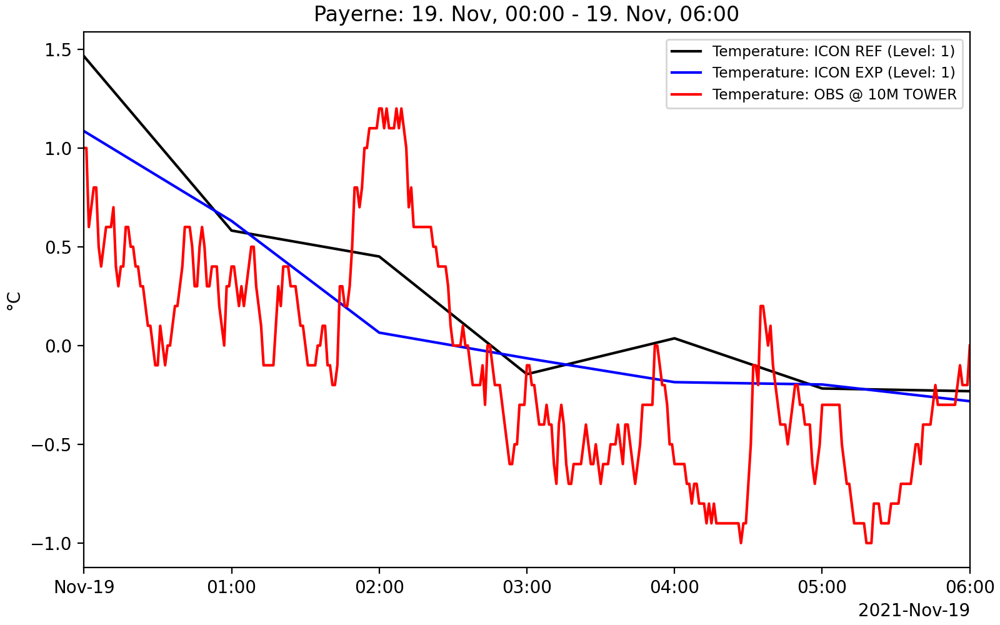

plot_icon_profiles
==================
Plot profiles of 1 variable for multiple leadtimes. Option to add observations of the same variable for times where they are available.
It is possible to plot 2 different variables in 1 graph. If more than 2 variables are specified, 3 separate plots are created.

``plot_icon_profiles --date 17101512 --folder /store/s83/swester/teamx/cap_2017101512/output/ --var temp --leadtime 6 --leadtime 8 --leadtime 10 --leadtime 12 --leadtime 14 --height_file /store/s83/swester/teamx/cap_2017101512/output/17101512/lfff00000000c.nc --loc ifl``

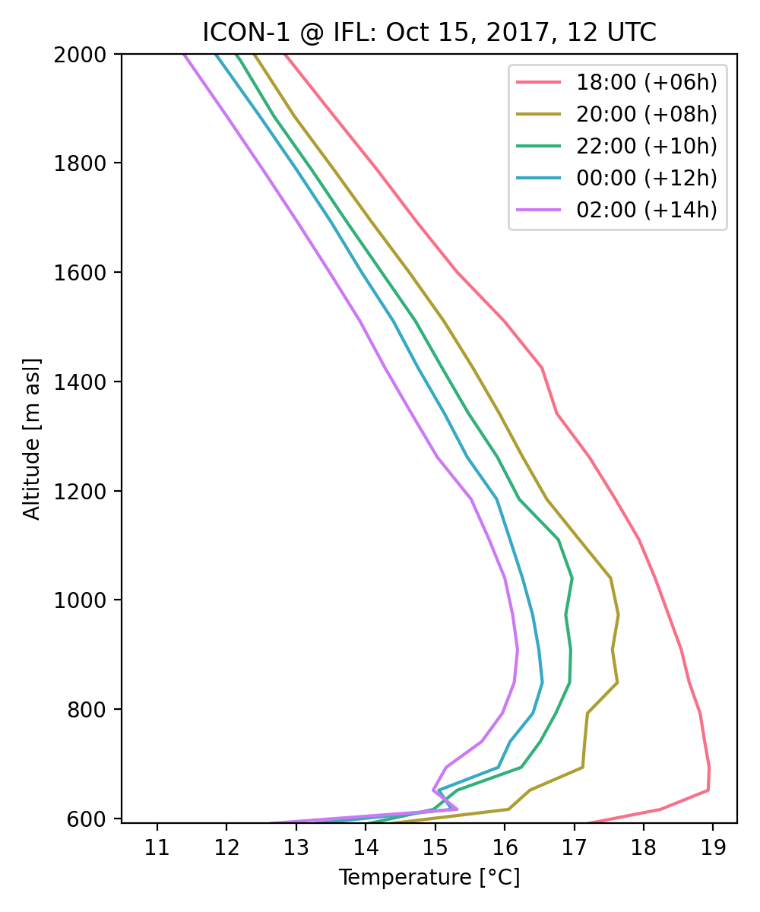

``plot_icon_profiles --date 21111812 --folder /scratch/swester/output_icon/ICON-1/ --var qc --var qc_dia --leadtime 18  --loc pay``

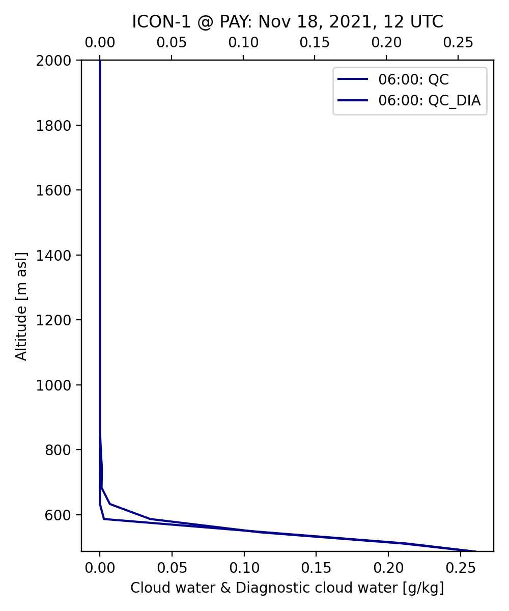

``plot_icon_profiles --date 21111012 --folder /scratch/swester/output_icon/ICON-1/ --var qv --var temp --var qc --leadtime 12 --leadtime 13 --loc gre``

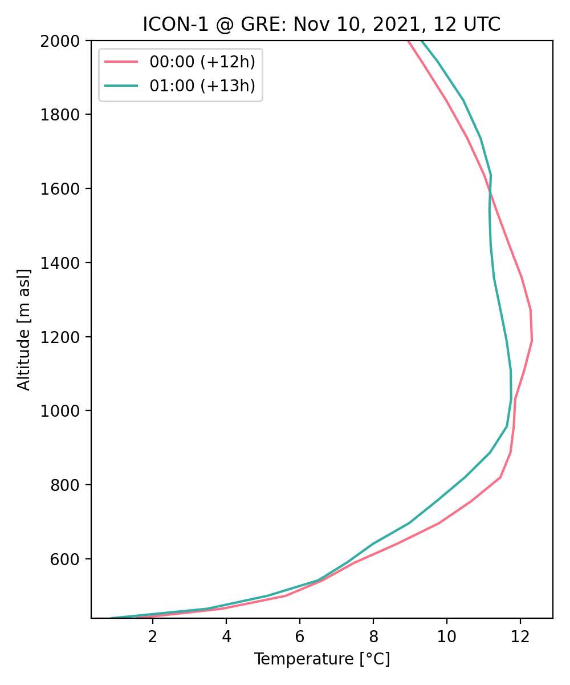

  
plot_icon_heatmap
=================
Plot heatmaps (also called "time-height-crosssections") of modelled 3D variables. Optionally add cloud base height measured by ceilometers.

! for some reason currently not understood the start_leadtime is not correctly used on the x-axis, always use *--start_leadtime 0*

``plot_icon_heatmap --date 17101512 --folder /store/s83/swester/teamx/cap_2017101512/output/ --var temp --alt_top 2500 --start_leadtime 0 --end_leadtime 18 --loc ifl --height_file /store/s83/swester/teamx/cap_2017101512/output/17101512/lfff00000000c.nc``

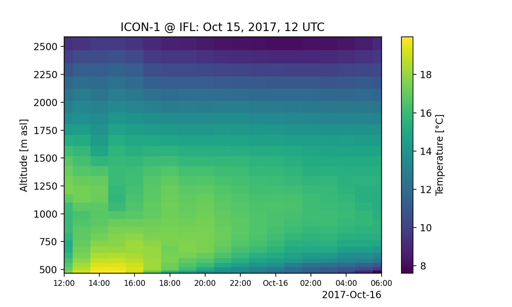

``plot_icon_heatmap --date 21111812 --folder /scratch/swester/output_icon/ICON-1/ --var temp --alt_top 2000 --start_leadtime 0 --end_leadtime 12 --verbose``

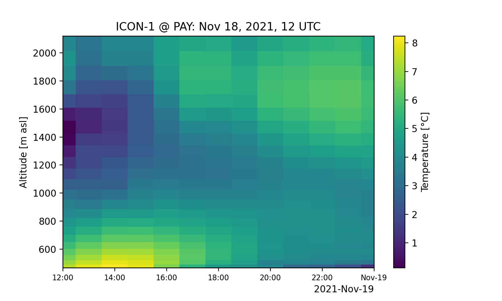

``plot_icon_heatmap --date 21111812 --folder /scratch/swester/output_icon/ICON-1/ --var clc --alt_top 2000 --start_leadtime 0 --end_leadtime 24 --add_cbh``

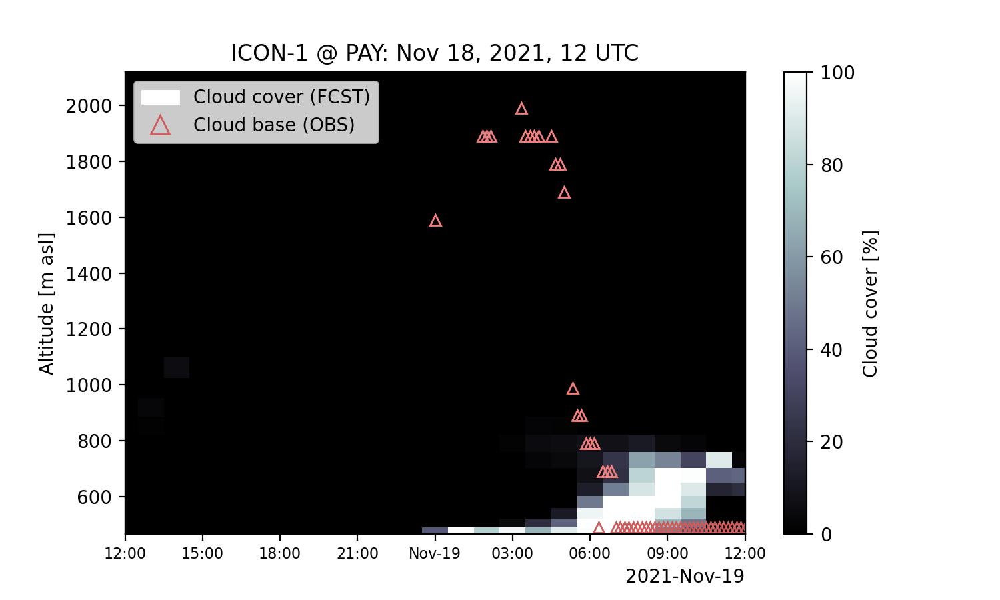
  

-------
Credits
-------

This package was created with `Cookiecutter`_ and the `MeteoSwiss-APN/mch-python-blueprint`_ project template.

.. _`Cookiecutter`: https://github.com/audreyr/cookiecutter
.. _`MeteoSwiss-APN/mch-python-blueprint`: https://github.com/MeteoSwiss-APN/mch-python-blueprint

